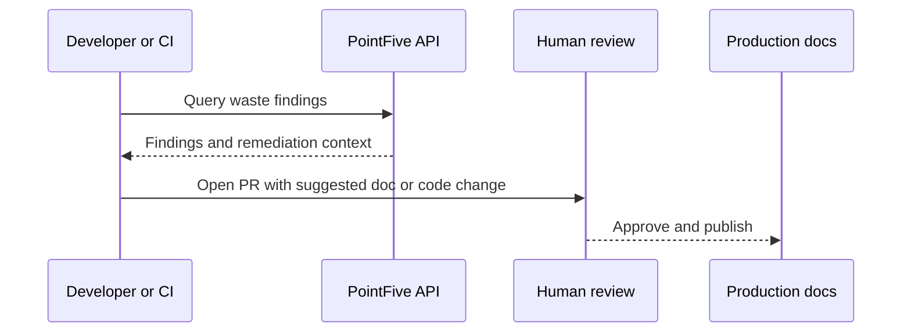

# Developer Docs

Use PointFive APIs and webhooks to bring cost intelligence into the workflows developers already use: pull requests, CI/CD checks, IDEs, FinOps dashboards, and remediation queues.

<table data-view="cards"><thead><tr><th width="48"></th><th></th><th></th><th data-hidden data-card-target data-type="content-ref"></th></tr></thead><tbody>
<tr><td><h3><i class="fa-bolt" style="color:$primary;"></i></h3></td><td><strong>Quickstart</strong></td><td>Create a token, query high-impact findings, and inspect remediation context.</td><td><a href="getting-started/quickstart.md">Quickstart</a></td></tr>
<tr><td><h3><i class="fa-key" style="color:$primary;"></i></h3></td><td><strong>Authentication</strong></td><td>Use scoped service tokens safely across development, CI, and production.</td><td><a href="api-authentication.md">Authentication</a></td></tr>
<tr><td><h3><i class="fa-webhook" style="color:$primary;"></i></h3></td><td><strong>Webhooks</strong></td><td>Receive findings, remediation status changes, and policy alerts.</td><td><a href="webhooks.md">Webhooks</a></td></tr>
<tr><td><h3><i class="fa-triangle-exclamation" style="color:$primary;"></i></h3></td><td><strong>Troubleshooting</strong></td><td>Resolve auth failures, missing findings, duplicate events, and rate limits.</td><td><a href="troubleshooting.md">Troubleshooting</a></td></tr>
</tbody></table>

## Typical flow

