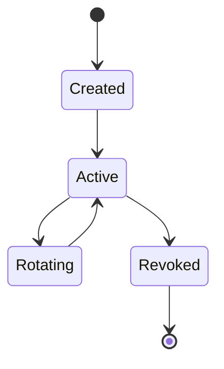

# API authentication

PointFive API requests use bearer tokens. Create separate service tokens for local development, CI/CD, and production automation.

## Header

```http
Authorization: Bearer <POINTFIVE_API_TOKEN>
```

## Recommended scopes

| Scope | Use |
| --- | --- |
| `findings:read` | Query DeepWaste and AI usage findings. |
| `remediations:write` | Create or update remediation tasks. |
| `webhooks:write` | Register or rotate webhook endpoints. |
| `accounts:read` | Resolve account and environment metadata. |


Use the narrowest token that can complete the job. CI jobs that only annotate pull requests should not receive write access to remediation records.


## Token lifecycle



## Common authentication failures

<details>
<summary>`401 Unauthorized`</summary>

The token is missing, expired, malformed, or revoked. Check the `Authorization` header and rotate the token if needed.
</details>

<details>
<summary>`403 Forbidden`</summary>

The token is valid but does not have the required scope for this endpoint or account.
</details>
