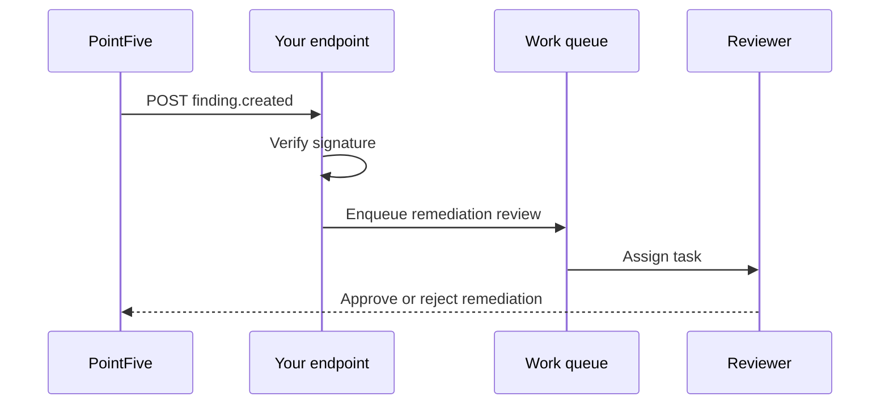

# Webhooks

Webhooks let your systems react when PointFive creates a finding, updates remediation status, or detects an AI usage policy event.

## Delivery flow



## Verify signatures

Every webhook request includes a timestamp and signature.

```bash
X-PointFive-Timestamp: 2026-07-13T12:00:00Z
X-PointFive-Signature: sha256=...
```



```javascript
import crypto from "node:crypto";

function verifyWebhook(secret, timestamp, body, signature) {
  const payload = `${timestamp}.${body}`;
  const expected = crypto
    .createHmac("sha256", secret)
    .update(payload)
    .digest("hex");

  return crypto.timingSafeEqual(
    Buffer.from(`sha256=${expected}`),
    Buffer.from(signature)
  );
}
```



```python
import hmac
import hashlib

def verify_webhook(secret, timestamp, body, signature):
    payload = f"{timestamp}.{body}".encode()
    expected = hmac.new(secret.encode(), payload, hashlib.sha256).hexdigest()
    return hmac.compare_digest(f"sha256={expected}", signature)
```



## Retry behavior

| Response | PointFive behavior |
| --- | --- |
| `2xx` | Delivery is marked successful. |
| `4xx` | Delivery is not retried unless the event is manually replayed. |
| `5xx` or timeout | Delivery is retried with exponential backoff. |
