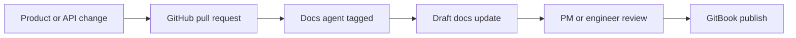

# Docs automation pipeline

PointFive's key requirement is docs automation tied to code changes with human review before publishing.

## Recommended checks

- Detect changed API schema or GraphQL fields.
- Suggest guide updates for new remediation workflows.
- Block publishing until required reviewers approve.
- Keep AI-generated drafts visible as suggestions, not silent changes.
